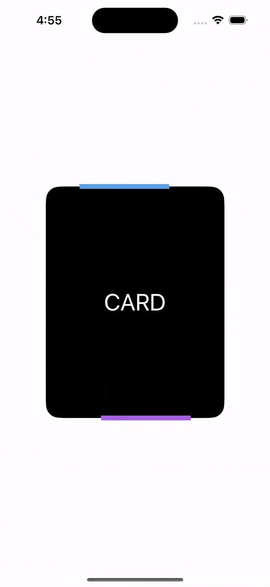
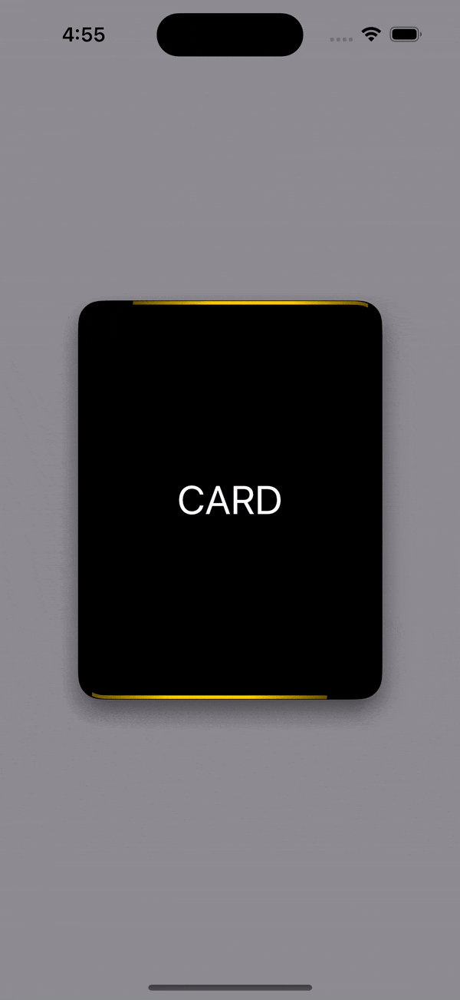
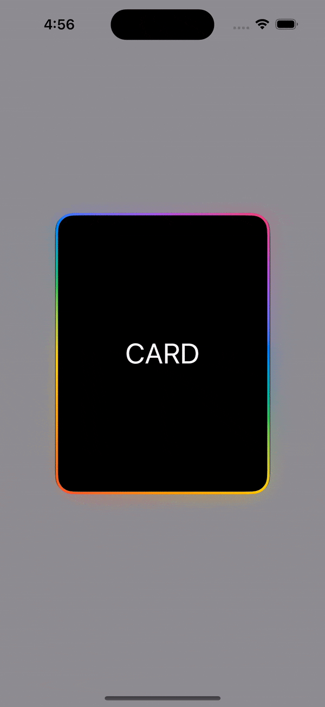

## FunAnimations

# [AddToBagAnimationTest](https://github.com/samgusa/FunAnimations/tree/main/AddToBagAnimationTest)

credit: [Kavsoft](https://www.youtube.com/watch?v=TTftmkW9N8s&t=4s)

# [BlockTest](https://github.com/samgusa/FunAnimations/tree/main/BlockTest)

credit: [https://github.com/vijaywargiya/LegoLoadingAnimation-SwiftUI/tree/main](https://github.com/vijaywargiya/LegoLoadingAnimation-SwiftUI/tree/main)

# [CustomKeyboardTest](https://github.com/samgusa/FunAnimations/tree/main/CustomKeyboardTest)

credit: [Kavsoft](https://www.youtube.com/watch?v=jNpdpO32Pjs)

# [ElasticTest](https://github.com/samgusa/FunAnimations/tree/main/ElasticTest)

credit: [Kavsoft](https://www.youtube.com/watch?v=Xjp1bIoSOHs)

# [GestureExpansionTest](https://github.com/samgusa/FunAnimations/tree/main/GestureExpansionTest)

credit: [Kavsoft](https://www.youtube.com/watch?v=4S3wwf2JcBE)

## [GradientBorderTest](https://github.com/samgusa/FunAnimations/tree/main/GradientBorderTest)

  
  &nbsp;&nbsp;&nbsp;
  
  &nbsp;&nbsp;&nbsp;
  

credit: [SuCodee](https://www.youtube.com/watch?v=PZNGUARnAjU)

## [GridTest](https://github.com/samgusa/FunAnimations/tree/main/GridTest)

credit: [Kavsoft](https://www.youtube.com/watch?v=UFiOCcm6zTo&t=26s)

# [InfiniteScroll](https://github.com/samgusa/FunAnimations/tree/main/InfiniteCarousel)

credit: [Kavsoft](https://www.youtube.com/watch?v=Yg2wh9uJ9Fk)

# [ScrollHideTest](https://github.com/samgusa/FunAnimations/tree/main/ScrollHideTest)

credit: [Kavsoft](https://www.youtube.com/watch?v=Q0rb4M6n2ns&t=15s)

# [ShapeMorphing](https://github.com/samgusa/FunAnimations/tree/main/ShapeMorphingTest)

credit: [Kavsoft](https://www.youtube.com/watch?v=HVNxfI8XYMw)

# [Shimmer](https://github.com/samgusa/FunAnimations/tree/main/ShimmerTest)

credit: [Kavsoft](https://www.youtube.com/watch?v=yhFz_DXFxec)

# [SmoothDropdown](https://github.com/samgusa/FunAnimations/tree/main/SmoothDropdownTest)

credit: [iRaul](https://github.com/iRaul/SmoothDropdown)

# [Sticky](https://github.com/samgusa/FunAnimations/tree/main/StickyTest)

credit: [https://www.youtube.com/watch?v=gKDHWT1MPOY](https://www.youtube.com/watch?v=gKDHWT1MPOY)
