## FunAnimations

# [AddToBagAnimationTest](https://github.com/samgusa/FunAnimations/tree/main/AddToBagAnimationTest)

credit: [Kavsoft](https://www.youtube.com/watch?v=TTftmkW9N8s&t=4s)

# [BlockTest](https://github.com/samgusa/FunAnimations/tree/main/BlockTest)

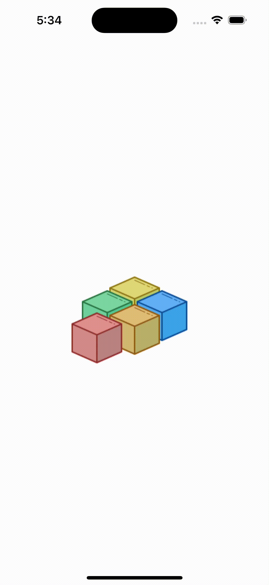

credit: [https://github.com/vijaywargiya/LegoLoadingAnimation-SwiftUI/tree/main](https://github.com/vijaywargiya/LegoLoadingAnimation-SwiftUI/tree/main)

# [CustomKeyboardTest](https://github.com/samgusa/FunAnimations/tree/main/CustomKeyboardTest)

credit: [Kavsoft](https://www.youtube.com/watch?v=jNpdpO32Pjs)

# [CustomTransitionTest](https://github.com/samgusa/FunAnimations/tree/main/CustomTransitionTest)

credit: [DesignCode](https://www.youtube.com/watch?v=f0wYIYfPBa4)

# [ElasticTest](https://github.com/samgusa/FunAnimations/tree/main/ElasticTest)

credit: [Kavsoft](https://www.youtube.com/watch?v=Xjp1bIoSOHs)

# [FigitTest](https://github.com/samgusa/FunAnimations/tree/main/FigitTest)

credit: [https://github.com/Kushalbhavsar/FidgetText](https://github.com/Kushalbhavsar/FidgetText)

# [GooeyTest](https://github.com/samgusa/FunAnimations/tree/main/GooeyTest)

credit: [Kavsoft](https://www.youtube.com/watch?v=jWvNdSetIXo&t=19s)

# [Hero Animation2](https://github.com/samgusa/FunAnimations/tree/main/HeroAnimation2Test)

credit: [Kavsoft](https://www.youtube.com/watch?v=8sgjvgBasYM)

# [Hero Animation](https://github.com/samgusa/FunAnimations/tree/main/HeroAnimationTest)

credit: [Kavsoft](https://www.youtube.com/watch?v=AjiLR9ORhzM)

# [InfiniteScroll](https://github.com/samgusa/FunAnimations/tree/main/InfiniteCarousel)

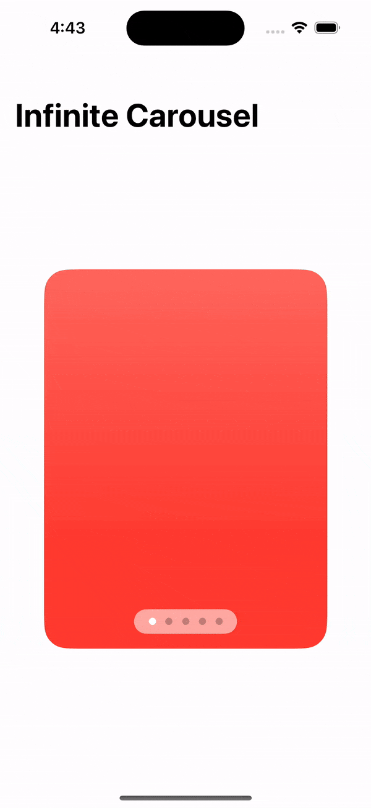

credit: [Kavsoft](https://www.youtube.com/watch?v=Yg2wh9uJ9Fk)

# [LiquidButton](https://github.com/samgusa/FunAnimations/tree/main/LiquidButtonTest)

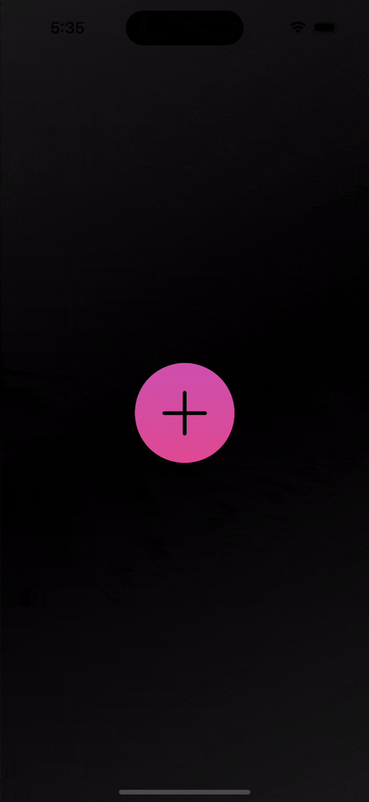

credit: [https://github.com/Kushalbhavsar/Liquid-Menu-Buttons/tree/main](https://github.com/Kushalbhavsar/Liquid-Menu-Buttons/tree/main)

# [LoginTest](https://github.com/samgusa/FunAnimations/tree/main/LoginTest)

credit: [Kavsoft](https://www.youtube.com/watch?v=KPYN6sjWvlA)

# [ScrollHideTest](https://github.com/samgusa/FunAnimations/tree/main/ScrollHideTest)

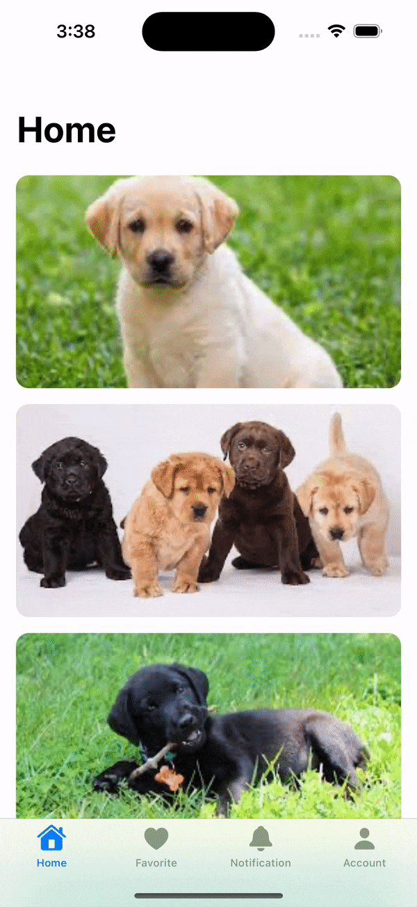

credit: [Kavsoft](https://www.youtube.com/watch?v=Q0rb4M6n2ns&t=15s)

# [ShapeMorphing](https://github.com/samgusa/FunAnimations/tree/main/ShapeMorphingTest)

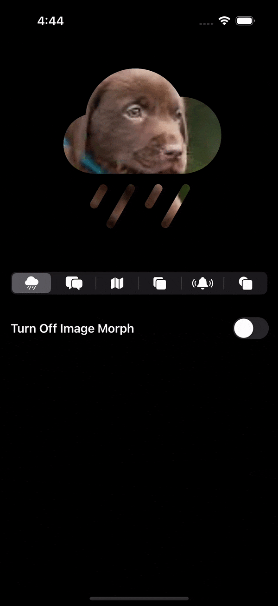

credit: [Kavsoft](https://www.youtube.com/watch?v=HVNxfI8XYMw)

# [Shimmer](https://github.com/samgusa/FunAnimations/tree/main/ShimmerTest)

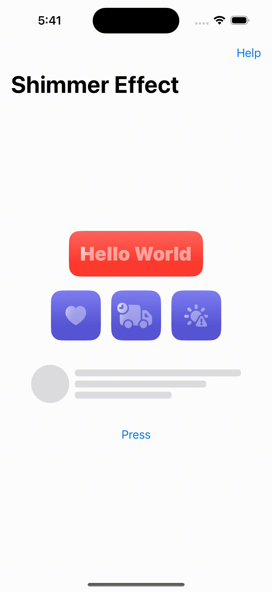

credit: [Kavsoft](https://www.youtube.com/watch?v=yhFz_DXFxec)

# [SmoothDropdown](https://github.com/samgusa/FunAnimations/tree/main/SmoothDropdownTest)

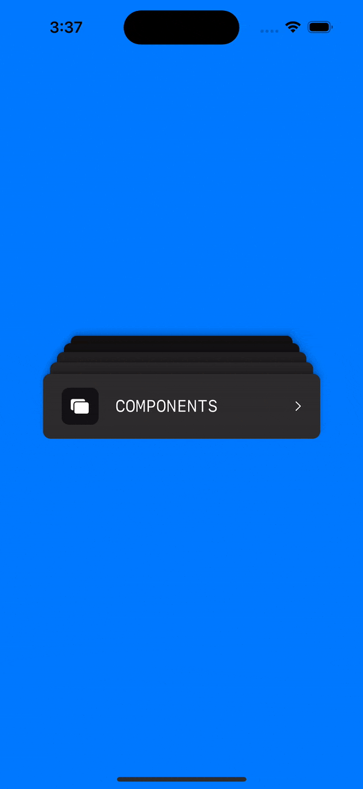

credit: [iRaul](https://github.com/iRaul/SmoothDropdown)

# [Sticky](https://github.com/samgusa/FunAnimations/tree/main/StickyTest)

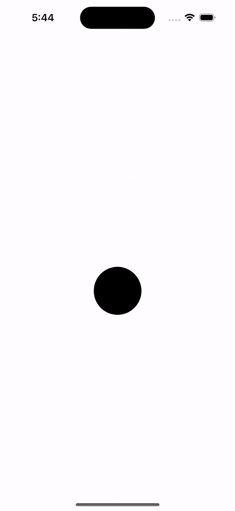

credit: [https://www.youtube.com/watch?v=gKDHWT1MPOY](https://www.youtube.com/watch?v=gKDHWT1MPOY)

# [TabbarTest](https://github.com/samgusa/FunAnimations/tree/main/TabBarTest)

  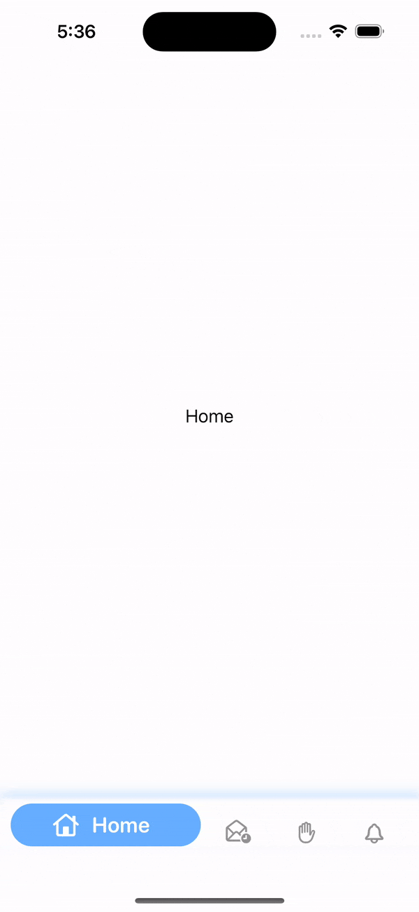
  &nbsp;&nbsp;&nbsp;
  
  &nbsp;&nbsp;&nbsp;
  

credit: [Kavsoft](https://www.youtube.com/watch?v=Lw-vimpu6Cs&t=3s)

credit: [Kavsoft](https://www.youtube.com/watch?v=Lw-vimpu6Cs&t=3s)

credit: [Kavsoft](https://www.youtube.com/watch?v=XZuc8WnZIS4&t=2s)

credit: [https://github.com/pratikg29/CustomTabBar](https://github.com/pratikg29/CustomTabBar)

# [ToggleTest](https://github.com/samgusa/FunAnimations/tree/main/ToggleTest)

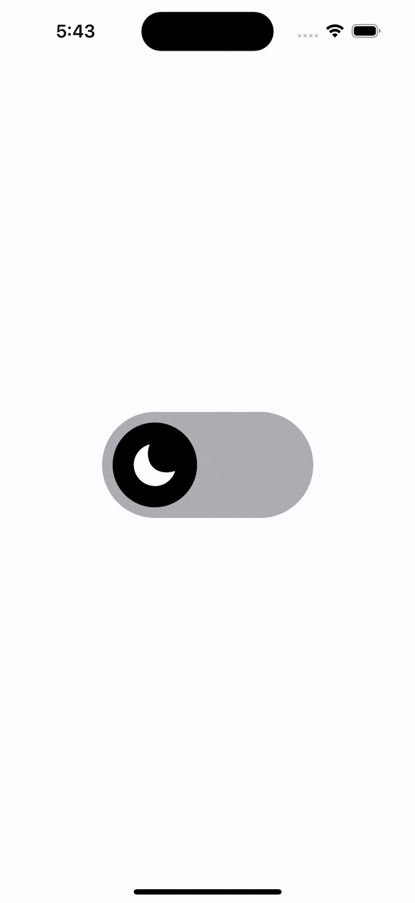

credit: [https://github.com/ordinaryindustries/rubber-band-toggle/tree/main](https://github.com/ordinaryindustries/rubber-band-toggle/tree/main)

# [UnderlineTabBar](https://github.com/samgusa/FunAnimations/tree/main/UnderlineTabBarTest)

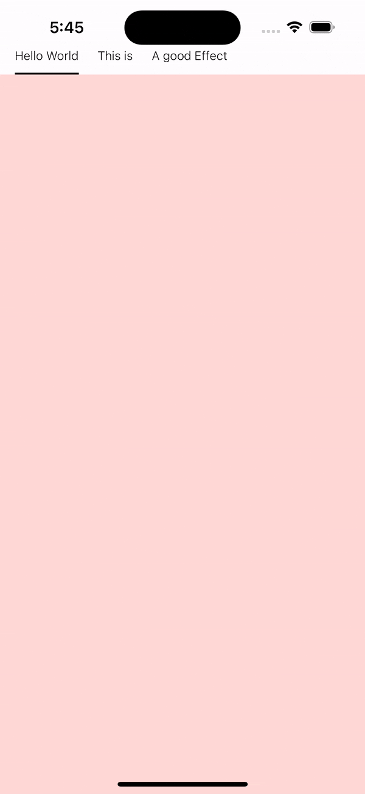

credit: [https://medium.com/@Archetapp/creating-an-animated-tab-bar-3cef48b9e8ed](https://medium.com/@Archetapp/creating-an-animated-tab-bar-3cef48b9e8ed)

 

